# Engineering wiki · Jay · Just Move In
### System design · data flows · deployment · product flows · analytics
**Jeanne Piffaut · July 2026**

This is the engineer wiki for taking the clickable demo to production. Intended to live in Notion (paste/import from this file); it is not part of the product UI.  
Companion specs: [`HANDOFF.md`](HANDOFF.md) (states & contracts), [`USER-JOURNEY.md`](USER-JOURNEY.md) (life of the move), [`COMPONENTS.md`](COMPONENTS.md) (UI inventory).  
**Product HTML (the app):** [`prototype/index.html`](prototype/index.html) · live: https://just-move-in-liard.vercel.app  
Analytics mock (optional): [`analytics/dashboard.html`](analytics/dashboard.html).

---

## How to read this

| Part | What it covers |
|---|---|
| **A · System design** | Services, databases, networks, trust boundaries |
| **B · Runtime data flows** | How a user action and a webhook move through the stack |
| **C · Dev & deployment** | Repos, environments, CI/CD, release, observability |
| **1-3 · Product flows** | Full journey, UI map, per-surface event charts |
| **4-6 · Instrumentation** | Event catalogue, funnels, dashboard |
| **D · Dashboard data path** | Events → warehouse → metrics & guardrails |
| **E · Production readiness** | Can a JMI engineer ship the demo correctly from this pack? |

Event names use `snake_case`. Payload fields are the minimum production schema; the prototype may only simulate them.

Authoritative split:
- **Demo wins on visual UI** (layout, copy, component structure).
- **This wiki + HANDOFF win on behaviour** (states, cascades, what must never ship).

---

# A · System design

## A.1 Design goals (non-negotiable)

1. **Watching gate**, no outbound notify/switch while `move.state = watching` (enforce in the scheduler, not only the client).
2. **Honest receipts**, `confirmed` only with `confirmationMethod != null` AND stored `receipt_id` (DB constraint).
3. **Board is system of record**, Home/Tasks read task state from one store; Visual lens is derived, never a second truth.
4. **Commerce always confirms**, energy / broadband / insurance never auto-purchase.
5. **Human escape**, named specialist reachable without a chatbot gate.
6. **Cascade integrity**, `move_date_changed` must yield `lost = 0`.

## A.2 Logical service map

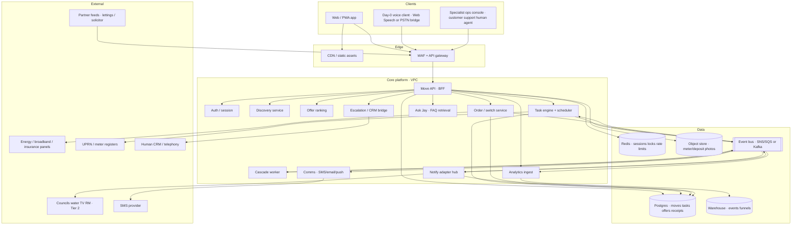

### Service responsibilities

| Service | Owns | Must not own |
|---|---|---|
| **Move API (BFF)** | Authz, screen aggregates, command validation | Direct partner HTTP from UI |
| **Discovery** | Adaptive Q&A, confidence stop, fan-out fields | Ranking prices |
| **Offer ranking** | One pick/category, time-compressed sort, panel metadata | Placing switches |
| **Task engine** | Catalogue instantiation, deps, states, chase timers | UI routing |
| **Cascade worker** | `move_date_changed` graph walk | Silent task drops |
| **Order / switch** | Panel commerce after confirm + safety gate | Tier-2 council forms |
| **Notify hub** | Destination adapters, amend/send, receipt ingest | Marking `confirmed` without receipt |
| **Comms** | Templates, suppression by `move.state` + prefs | Business state transitions |
| **Ask Jay** | FAQ retrieval + escalate | Payment / credentials / policy invention |
| **Analytics ingest** | Envelope validate, PII strip, fan-out to WH | Product decisions |

## A.3 Data stores

| Store | Contents | Notes |
|---|---|---|
| **Postgres** | `moves`, `tasks`, `offers_snapshot`, `orders`, `receipts`, `loa`, `destinations`, `rules` | Source of truth for state |
| **Redis** | Sessions, idempotency keys, scheduler locks, rate limits | Ephemeral |
| **Object store** | Meter photos, deposit sets, LOA PDFs | Signed URLs; virus scan on upload |
| **Event bus** | Domain events (`move_state_changed`, `task_state_changed`, …) | At-least-once; consumers idempotent |
| **Warehouse** | `fact_event`, `dim_move`, `dim_task`, `fact_funnel_step` | Analytics only; no command path |

### Postgres constraints (ship day one)

```sql
-- Pseudocode constraints / triggers
CHECK (task.state <> 'confirmed' OR (confirmation_method IS NOT NULL AND receipt_id IS NOT NULL))
-- Scheduler query must include: moves.state NOT IN ('watching','cancelled')
-- Cascade job asserts lost_or_reentered = 0 before ACK
```

## A.4 Network & trust boundaries

| Zone | What lives here | Ingress |
|---|---|---|
| **Public** | CDN, marketing, PWA | HTTPS only |
| **Edge** | API gateway, WAF, mTLS for partner webhooks | Signed webhooks (HMAC), IP allowlists where partners support |
| **App subnet** | Stateless services | Private; no public DB |
| **Data subnet** | Postgres, Redis | Security groups: app subnet only |
| **Analytics** | Ingest → WH | Write-only from ingest; BI read replicas / separate IAM |
| **Egress** | Notify/order adapters | Allowlisted destinations; secrets in KMS/Secrets Manager |

**PII / security rules**
- No bank details, OTPs, or passwords on voice.
- Analytics props: IDs and lengths only (no meter numbers, addresses, chat bodies).
- LOA and photos: encrypted at rest; access audited.
- Specialist console: SSO + role; every override writes an audit row.

## A.5 Prototype → production mapping

| Demo (single HTML file) | Production |
|---|---|
| `go()` / `data-screen` | Client router + Move API screen DTOs |
| `localStorage` discovery/basket flags | Server move + session progress |
| Hard-coded offers | `GET /offers` from ranking + panel feed |
| Fake `sent · no receipt` | Notify hub + destination catalogue |
| Web Speech in-tab | Same intents; optional PSTN bridge later |
| Demo jump pills | Remove; deep links / feature flags only |
| Static dashboard HTML | WH + BI tool on same metrics |

---

# B · Runtime data flows

## B.1 Read path (Home board)

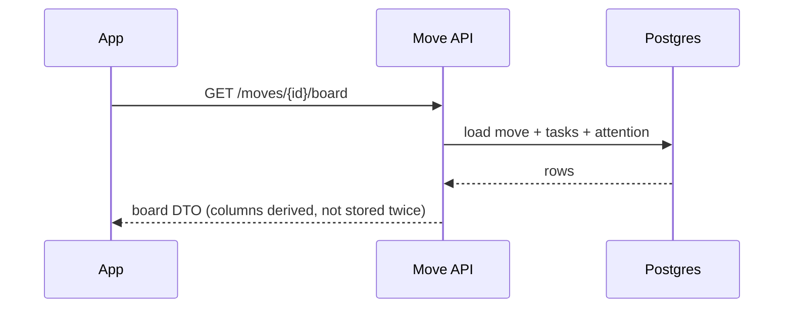

## B.2 Write path (basket confirm → orders + tasks)

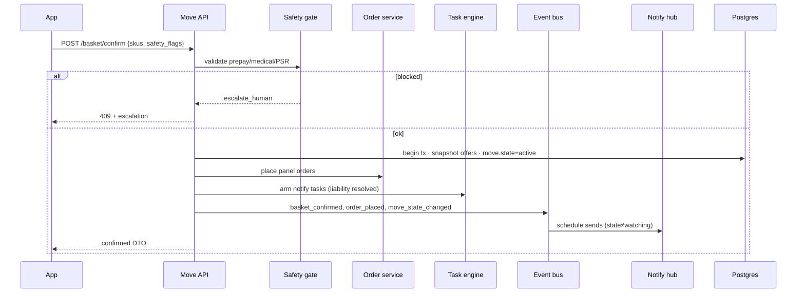

## B.3 Webhook path (exchange confirmed)

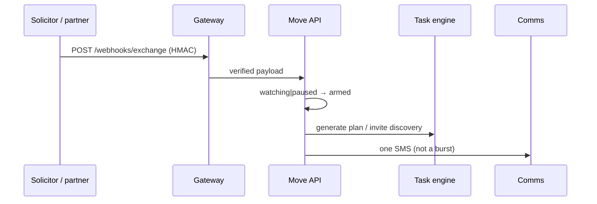

## B.4 Cascade path (date change)

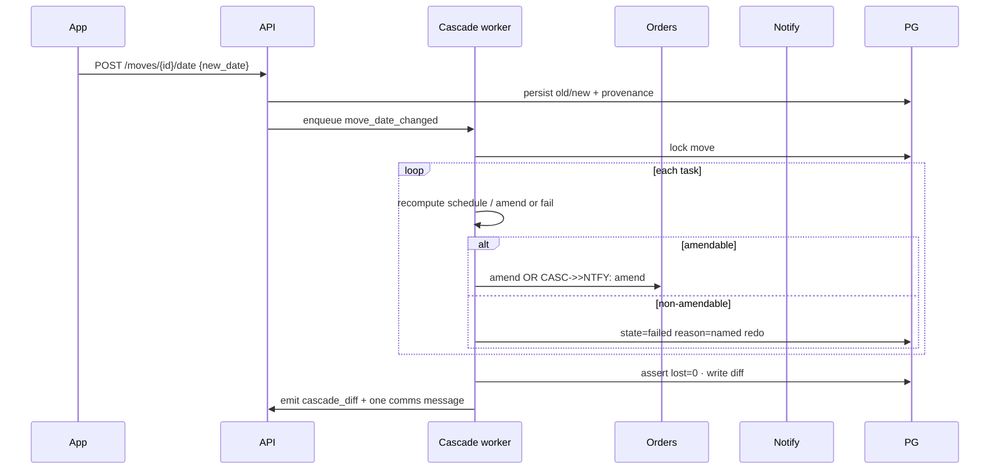

## B.5 Analytics path (every interaction)

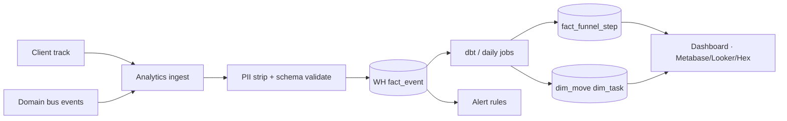

---

# C · Software development & deployment architecture

## C.1 Suggested repo layout

```
jay-platform/
  apps/
    web/                 # PWA (lift tokens/CSS from prototype)
    ops-console/         # specialist tools
  services/
    move-api/
    discovery/
    ranking/
    task-engine/
    cascade-worker/
    order-service/
    notify-hub/
    comms/
    analytics-ingest/
  packages/
    contracts/           # OpenAPI + JSON schemas + event envelope
    catalogue/           # task + destination rules
    ui-tokens/           # from prototype :root / tokens/
  infra/
    terraform/           # VPC, RDS, bus, CDN
    k8s/ or ecs/         # service charts
  analytics/
    dbt/                 # funnel models
```

Demo stays in this design repo (`prototype/`) until UI is ported; do not treat the HTML file as the production app server.

## C.2 Environments

| Env | Purpose | Data |
|---|---|---|
| **local** | docker-compose: API + Postgres + Redis + localstack bus | Fixtures / anonymised |
| **dev** | Shared integration | Synthetic partners |
| **staging** | Prod-like; webhook sandboxes | Masked prod subset |
| **prod** | Live movers | Real; break-glass only |

Feature flags: `time_compressed`, `voice_day0`, `market_v1`, `ask_jay`. Demo jumps never ship.

## C.3 CI/CD pipeline

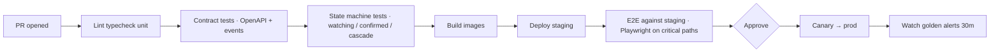

**Required automated tests before merge**
- Watching: zero `notify_sent` while watching.
- Confirmed constraint: insert without receipt fails.
- Cascade: Royal Mail → `failed` named redo; `lost = 0`.
- Basket: safety flags block or escalate.
- Ranking: `days_to_move < 14` sorts broadband by `activation_days`.

## C.4 Release & rollback

- DB migrations expand/contract (no lock-step breaks).
- Canary 5% → 25% → 100% on Move API and Task engine.
- Rollback: previous image + feature-flag kill switches (voice, market, outbound notify pause).
- Outbound pause switch: halt Notify hub without taking the app down.

## C.5 Observability

| Signal | Use |
|---|---|
| **Traces** | `move_id` as baggage on every span |
| **Metrics** | `outbound_while_watching`, `false_confirmed_attempts`, `cascade_lost`, API latency |
| **Logs** | Structured JSON; no PII in message fields |
| **Product alerts** | Same as §D.3 (page on watching leak / false confirmed) |

---

# 1 · Full user flow (beyond the UI)

Most of the product has no screen. Channels: `invisible` · `sms` · `app` · `voice` · `world` · `3rd_party` · `human`.

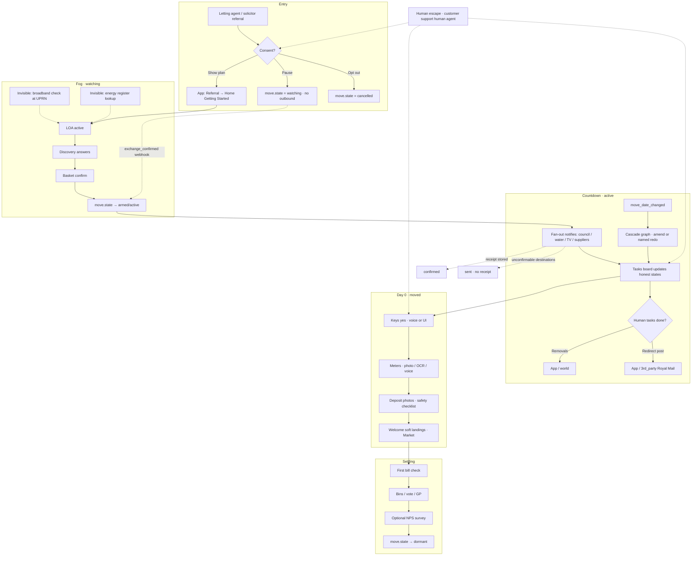

### Lifecycle vs app (summary)

| Move stage | `move.state` | App surfaces | Non-app work |
|---|---|---|---|
| Offer → exchange | `watching` | Referral, Getting Started (read-only outbound) | SMS map; no council/supplier contact |
| Exchange → move | `armed` → `active` | Discovery, Basket, Pre-move, Tasks, Date change | Notify fan-out; chase schedules; SMS reminders |
| Move day | `moved` | Home · Move-in day (voice+UI) | Voice intents; occupancy fires; world unload |
| Day 1-14 | `settling` | Post-move, Market, bill check | Engineer visit tracking; soft survey |
| After | `dormant` | Settings / renewals later | Month-11 renewal seed |

Full step table: [`USER-JOURNEY.md`](USER-JOURNEY.md).

---

# 2 · UI flow (prototype screens)

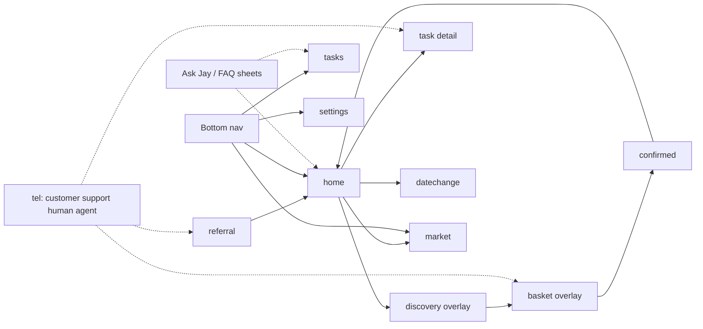

### Screen inventory

| `data-screen` | Role | Opens from |
|---|---|---|
| `referral` | Permission / watching explainer | Entry, demo jump |
| `home` | Hub with tabs: `started` · `pre` · `day0` · `post` | Nav, referral CTAs |
| `discovery` | Adaptive Q&A overlay | Getting Started CTA |
| `basket` | One-pick carousels + safety gate | Discovery / Change plan |
| `confirmed` | Closure artifact | Basket confirm |
| `tasks` | Kanban + Visual | Nav |
| `task` | Catalogue transparency detail | Task rows |
| `datechange` | Calendar + cascade | Date bar, Settings |
| `market` | Local listings | Nav, Day 0 / Post links |
| `settings` | Consent, LOA, notifications | Nav |
| Sheets | `chatSheet`, `faqSheet`, `sharedModal` | Ask bar, FAQ, tips |

Return memory: overlays and hard screens restore `{ screen, tab }` via `returnTo`.

---

# 3 · Per-tab / per-surface engineer flow charts

Payload envelope for every client event:

```json
{
  "event": "string",
  "ts": "ISO-8601",
  "move_id": "mv_…",
  "session_id": "ses_…",
  "user_id": "usr_…",
  "screen": "home|tasks|…",
  "home_tab": "started|pre|day0|post|null",
  "source": "ui|voice|sms|webhook|system|human",
  "props": {}
}
```

Server/domain events use the same `event` names where possible; `source` distinguishes origin.

---

## 3.1 Referral

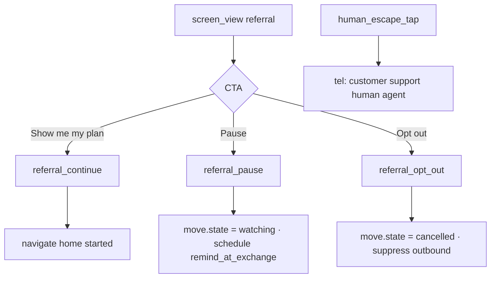

| Event | When | Key props | Server effect |
|---|---|---|---|
| `screen_view` | Screen shown | `screen=referral` |, |
| `referral_continue` | Primary CTA |, | Ensure move record; open app |
| `referral_pause` | Pause CTA |, | `watching`; SMS at exchange |
| `referral_opt_out` | Opt out | `reason?` | Cancel; stop partner feeds |
| `human_escape_tap` | customer support human agent link | `surface=referral` | Log; optional CRM ticket |

---

## 3.2 Home · Getting Started (`started`)

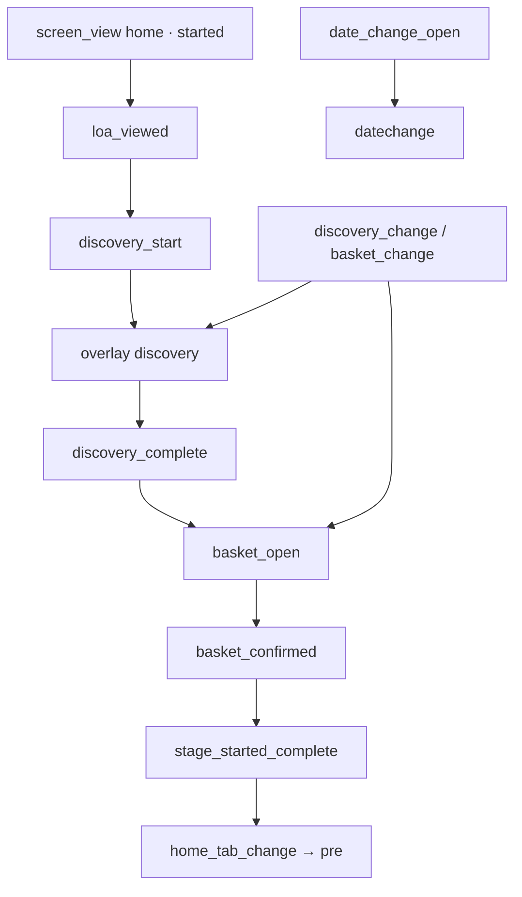

| Event | When | Key props | Server effect |
|---|---|---|---|
| `home_tab_change` | Tab selected | `from`, `to` |, |
| `loa_viewed` | LOA card in view | `status=active` |, |
| `discovery_start` | Start discovery | `return_tab=started` | Start discovery session |
| `discovery_change` | Change answers |, | Reopen discovery |
| `basket_open` | Confirm basket / Change plan | `entry=started|tasks|discovery` | Load ranked SKUs |
| `basket_change` | Change plan link |, | Reopen basket |
| `stage_started_complete` | Discovery + basket done |, | Unlock Pre-move ticks |
| `milestone_open` | Mile card modal | `stage` |, |
| `alerts_open` | Bell | `count` |, |
| `date_change_open` | Change date | `provenance` |, |

---

## 3.3 Discovery overlay

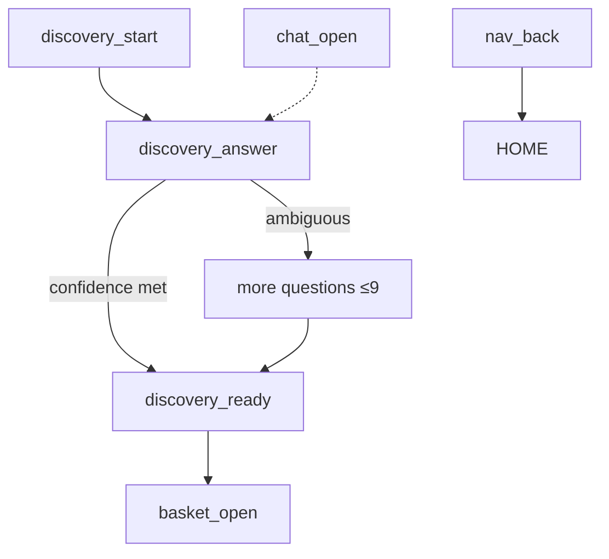

| Event | When | Key props | Server effect |
|---|---|---|---|
| `discovery_answer` | Option selected | `question_id`, `value`, `index` | `POST /discovery/next` |
| `discovery_ready` | Threshold met | `answer_count`, `confidence` | Persist fan-out fields |
| `discovery_complete` | Leave toward basket | `household_size`, `daytime_occupancy`, `tenancy_months`, … | Rank utilities |
| `discovery_abandon` | Back without ready | `last_question_id` | Funnel drop |

Fan-out fields drive energy band, broadband speed tier, max contract months.

---

## 3.4 Basket overlay

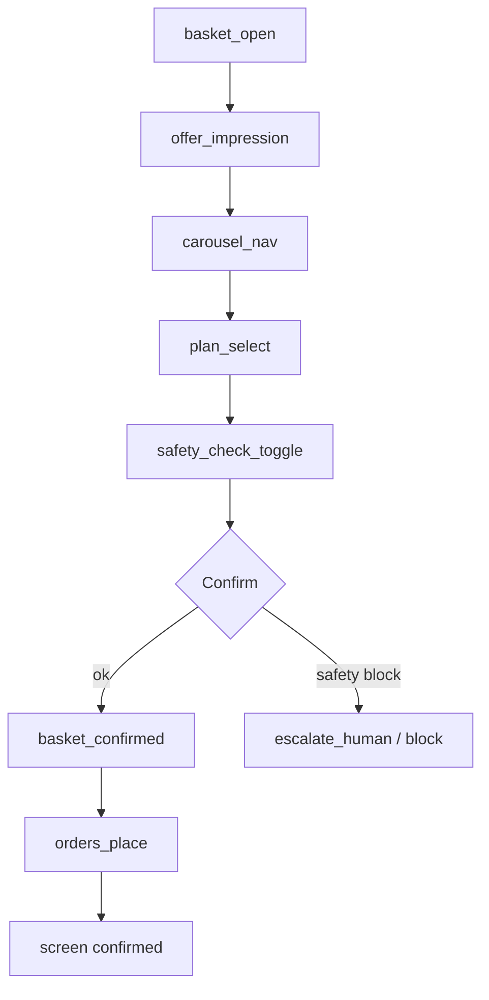

| Event | When | Key props | Server effect |
|---|---|---|---|
| `offer_impression` | Slide visible | `category`, `sku`, `rank`, `is_recommended` |, |
| `carousel_nav` | Prev/next | `category`, `from_i`, `to_i` |, |
| `plan_select` | Select this plan | `category`, `sku`, `price_month` | Update basket |
| `safety_check_toggle` | Prepay / medical / PSR | `flag`, `value` | Gate confirm |
| `basket_confirm_blocked` | Safety fired | `flags[]` | Route human |
| `basket_confirmed` | Confirm selected plans | `skus{}`, `panel_fee_shown`, `time_compressed`, `days_to_move` | Place orders; `move.state→active` |
| `tip_open` | `?` tip modal | `tip_id` |, |

---

## 3.5 Confirmed

| Event | When | Key props | Server effect |
|---|---|---|---|
| `closure_view` | Screen shown | `task_snapshot[]` |, |
| `closure_continue` | Go to Pre-move |, | Navigate |

---

## 3.6 Home · Pre-move (`pre`)

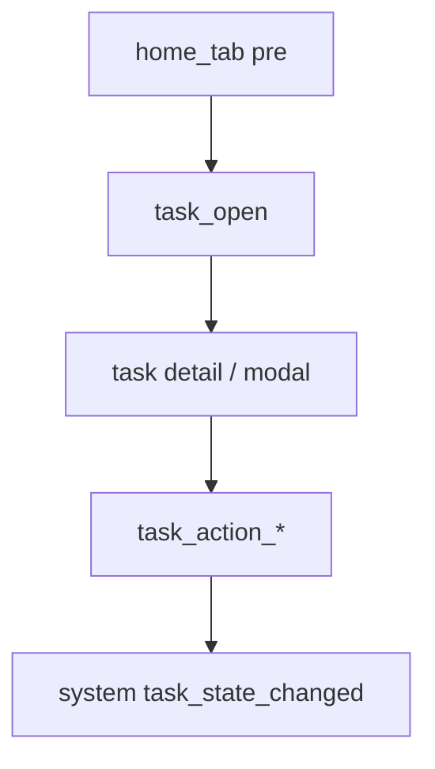

| Event | When | Key props |
|---|---|---|
| `task_open` | Task row | `task_id`, `owner`, `state` |
| `task_list_view` | Tab shown | `visible_task_ids[]` |
| `post_redirect_open` | Redirect modal | `deadline` |

System (non-UI) companions:

| Event | Source | Meaning |
|---|---|---|
| `task_state_changed` | Worker | `from`, `to`, `confirmation_method?`, `receipt_id?` |
| `notify_sent` | Worker | Destination contacted |
| `notify_confirmed` | Webhook | Receipt stored → `confirmed` |
| `notify_unconfirmable` | Worker | No API → `unconfirmable` |

---

## 3.7 Home · Move-in day (`day0`)

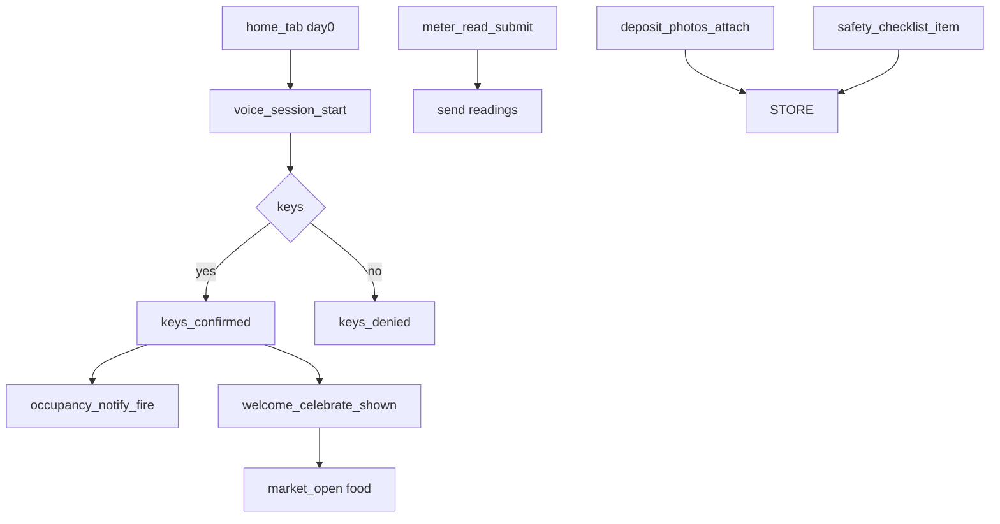

| Event | When | Key props | Server effect |
|---|---|---|---|
| `voice_session_start` | Auto or gesture | `auto`, `supported` |, |
| `voice_intent` | Speech match | `intent=yes|no|looks_right|wrong`, `confidence` | Same as UI |
| `voice_permission_denied` | Mic blocked |, | Fall back UI |
| `keys_confirmed` / `keys_denied` | Yes/No | `modality=voice|ui` | On yes: occupancy + cover start |
| `meter_photo_attach` | Photo button |, | OCR pipeline |
| `meter_read_submit` | Looks right / save | `elec`, `gas`, `corrected` | Send suppliers |
| `meter_read_reject` | Wrong |, | Open edit |
| `deposit_photos_attach` | Photos ready | `count` | Store evidence |
| `safety_checklist_item` | Toggle | `item_id`, `value` |, |
| `welcome_celebrate_shown` | After keys yes |, |, |
| `soft_landing_tap` | Pizza / playlist | `landing_id` |, |

---

## 3.8 Home · Post-move (`post`)

| Event | When | Key props |
|---|---|---|
| `bill_check_open` | First bill task | `estimated_delta` |
| `bill_confirm` | Confirm bill |, |
| `bill_dispute` | Dispute → chat | `seed_message` |
| `bins_open` | Bin days modal |, |
| `vote_link_open` | gov.uk link |, |
| `market_deep_link` | Register GP | `filter=gp` |
| `survey_step` | Answer/skip | `step`, `action=answer|skip|stop`, `value?` |
| `survey_complete` | Finish/done | `answers{}` |

---

## 3.9 Tasks (bottom nav)

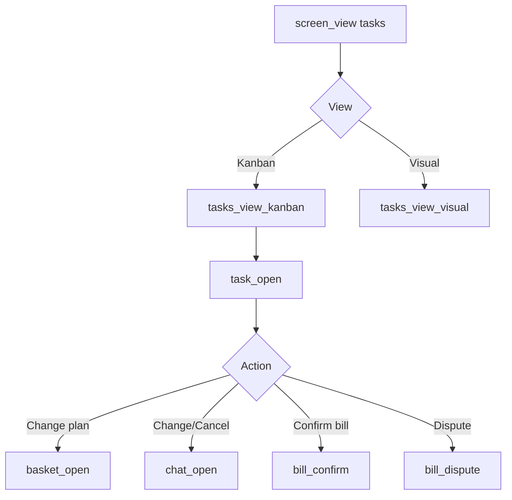

| Event | When | Key props |
|---|---|---|
| `tasks_view_toggle` | Kanban / Visual | `view` |
| `task_action_change_plan` | CTA | `task_id`, `category` |
| `task_action_change` | Opens change modal | `task_id` |
| `task_action_cancel` | Cancel confirm | `task_id` |
| `task_change_submit` | Note → chat | `note_len` |
| `visual_legend_state` | Optional | `tags_on[]` |

---

## 3.10 Task detail

Transparency rows are catalogue-driven. Log:

| Event | Props |
|---|---|
| `task_detail_view` | `task_id`, `state`, `waiting_on` |
| `task_faq_open` | `task_id` |
| `human_escape_tap` | `surface=task`, `task_id` |

---

## 3.11 Date change + cascade

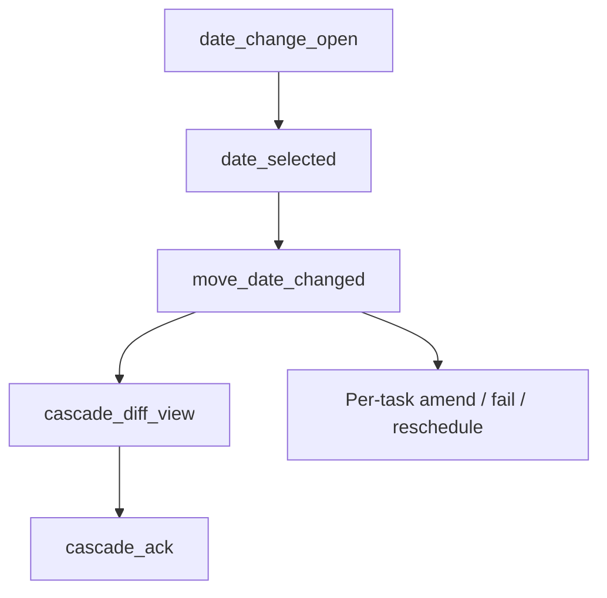

| Event | When | Key props | Server effect |
|---|---|---|---|
| `date_selected` | Calendar day | `old_date`, `new_date` | Preview only |
| `move_date_changed` | Move everything CTA | `old_date`, `new_date`, `provenance` | Full cascade (HANDOFF §3) |
| `cascade_diff_view` | Diff shown | `rescheduled`, `needs_redoing`, `lost` | `lost` must be 0 |
| `cascade_ack` | Looks right |, |, |
| `task_failed_non_amendable` | System | `task_id=post_redirect`, `reason` | Surface redo |

---

## 3.12 Market

| Event | When | Key props |
|---|---|---|
| `market_search` | Search submit | `query` |
| `market_filter` | Chip | `filter` |
| `market_filter_reset` | Reset |, |
| `listing_impression` | In view | `listing_id`, `type=panel|nhs|free` |
| `listing_open` | Tap | `listing_id` |
| `panel_fee_view` | Footer visible | `surface=market` |

---

## 3.13 Settings

| Event | When | Key props | Server effect |
|---|---|---|---|
| `settings_left_hand_toggle` | Switch | `value` | Persist preference |
| `settings_pause_toggle` | Pause until exchange | `value` | Outbound suppress |
| `settings_opt_out` | Opt out |, | Cancel move |
| `settings_notify_toggle` | Push/SMS/Email | `channel`, `value` | Preference |
| `loa_status_view` | LOA group | `status` |, |

---

## 3.14 Ask Jay / FAQ (global)

| Event | When | Key props |
|---|---|---|
| `chat_open` | Ask Jay | `seed?`, `surface` |
| `chat_send` | Message | `len`, `modality=text|mic` |
| `chat_close` | Close | `msg_count` |
| `faq_open` | FAQ | `surface` |
| `faq_item_open` | Accordion | `item_id` |
| `human_escape_tap` | Talk to customer support human agent | `surface=faq|chat` |

Rule: chat is a side channel. Funnel success must not require chat completion.

---

## 3.15 Cross-cutting system events

| Event | Source | Props / notes |
|---|---|---|
| `exchange_confirmed` | Solicitor webhook | Leaves `watching` |
| `move_state_changed` | System | `from`, `to` |
| `time_compressed_enter` | System | `days_to_move < 14` |
| `order_placed` | System | `category`, `sku` |
| `order_amended` / `order_cancelled` | Cascade |, |
| `escalation_created` | Safety / stall | `owner=customer support human agent`, `task_id?` |
| `sms_sent` / `sms_failed` | Comms | `template_id` |
| `receipt_stored` | Destination | Enables `confirmed` |

---

# 4 · Data collection points

Treat **every intentional user interaction** and **every durable system transition** as an event. Do not rely on pageviews alone.

### Collection rules

1. **Client** emits UI/voice events with the envelope in §3.
2. **Server** emits domain events; join on `move_id`.
3. **PII:** never put names, full addresses, meter numbers, or free-text chat bodies in analytics props. Use IDs and lengths.
4. **Identity:** `move_id` is the primary funnel key (one move = one journey).
5. **Sessions:** `session_id` for drop-off within a visit; attribute later sessions to the same `move_id`.

### Master event list (instrumentation checklist)

| # | Event | Surfaces |
|---|---|---|
| 1 | `screen_view` | All screens |
| 2 | `home_tab_change` | Home |
| 3 | `referral_continue` / `pause` / `opt_out` | Referral |
| 4 | `human_escape_tap` | Global |
| 5 | `discovery_start` / `answer` / `ready` / `complete` / `abandon` | Discovery |
| 6 | `basket_open` / `offer_impression` / `carousel_nav` / `plan_select` | Basket |
| 7 | `safety_check_toggle` / `basket_confirm_blocked` / `basket_confirmed` | Basket |
| 8 | `closure_view` / `closure_continue` | Confirmed |
| 9 | `task_open` / `task_detail_view` / `task_action_*` | Pre-move, Tasks, detail |
| 10 | `task_state_changed` / `notify_*` / `receipt_stored` | System |
| 11 | `voice_*` / `keys_*` / `meter_*` / `deposit_*` / `safety_checklist_item` | Day 0 |
| 12 | `welcome_celebrate_shown` / `soft_landing_tap` | Day 0 |
| 13 | `bill_*` / `survey_*` / `bins_open` / `vote_link_open` | Post-move |
| 14 | `tasks_view_toggle` | Tasks |
| 15 | `date_selected` / `move_date_changed` / `cascade_*` | Date change |
| 16 | `market_*` / `listing_*` | Market |
| 17 | `settings_*` / `loa_*` | Settings |
| 18 | `chat_*` / `faq_*` | Ask / FAQ |
| 19 | `exchange_confirmed` / `move_state_changed` / `order_*` / `sms_*` | System |
| 20 | `escalation_created` | Safety / stall / human |

---

# 5 · Success metrics and funnels

### North-star (product)

| Metric | Definition |
|---|---|
| **Honest completion rate** | Moves where all placed notifies are `confirmed` or explicitly `unconfirmable` (never false-green) |
| **Mover effort** | Median human tasks completed by mover / total tasks |
| **Date-change integrity** | Share of `move_date_changed` with `lost = 0` |

### Activation funnel (app)

```
referral_continue
  → discovery_start
    → discovery_complete
      → basket_open
        → basket_confirmed
          → closure_continue
            → keys_confirmed   (on/after move day)
```

### Feature success KPIs

| Feature | Primary metric | Guardrail |
|---|---|---|
| Watching gate | `% outbound while watching` → **0** | Support tickets "called too early" |
| One-pick basket | `% confirm with recommended SKU` | `% open Change plan` |
| Time-compressed | `% broadband pick = fastest install` when `days_to_move<14` | Price regret in survey |
| Unconfirmable UX | `% fog states shown where no receipt` | `% false confirmed` → **0** |
| Date cascade | `% lost=0` | Redo task completion time |
| Day 0 voice | `% keys via voice` vs UI | `% complete with UI-only` must stay high |
| Human escape | `% who see hatch` | `% escalate` (not vanity-low) |
| Market | `% listing_open` from Day 0 soft landing | Unlabelled affiliate rate → **0** |
| Survey | Response rate | Skip rate by step |

### Drop-off definition

A drop is a move that reached step N but not N+1 within the SLA window:

| Step | SLA window |
|---|---|
| Referral → Discovery start | 7 days after continue (or exchange) |
| Discovery start → complete | Same session or 48h |
| Basket open → confirmed | Same session or 48h |
| Confirmed → keys | Move day + 1d |
| Keys → meters submitted | Move day + 1d |

---

# 6 · Data dashboard (UI mock)

Open the interactive mock: **[`analytics/dashboard.html`](analytics/dashboard.html)**.

### Dashboard sections (build order)

1. **Health strip**, moves in each `move.state`; outbound-while-watching count (must be 0).
2. **Activation funnel**, counts and conversion between the steps in §5.
3. **Drop-off table**, step, entered, exited, drop %, median time-to-next.
4. **Feature cards**, one card per KPI table row with sparkline + guardrail.
5. **Task honesty**, distribution of `confirmed` vs `unconfirmable` vs `failed` by destination.
6. **Day 0 modality**, voice vs UI for keys and meters.
7. **Escape & chat**, human taps, chat opens, FAQ items (side-channel, not funnel).
8. **Date change**, cascade diffs; list non-amendable redos.
9. **Survey**, step completion / skip; theme tags from free text (server-side NLP, not raw in BI).

---

# D · Dashboard data flow · key metrics · guardrails

This is how production dashboards stay truthful: product UI and BI both read derived facts, never invent state.

## D.1 Data flow onto the dashboard

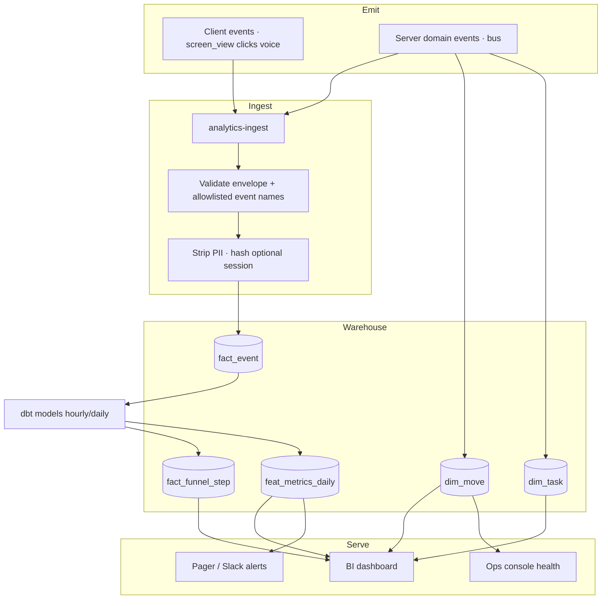

### Warehouse model

```
fact_event          (event, ts, move_id, session_id, screen, home_tab, source, props jsonb)
dim_move            (move_id, state, move_date, days_to_move, channel, partner, updated_at)
dim_task            (task_id, move_id, type, owner, state, confirmation_method, receipt_id)
fact_funnel_step    (move_id, step, entered_at, completed_at)  , derived
feat_metrics_daily  (date, metric_key, value, numerator, denominator)
```

**Join key for all funnels:** `move_id` (one move = one journey). `session_id` only for within-visit drop-off.

## D.2 Key metrics (definitions engineers can implement)

| Metric key | Formula | Dashboard tile |
|---|---|---|
| `moves_by_state` | count(dim_move) group by state | Health strip |
| `outbound_while_watching` | count notify_sent where move.state=watching | Health strip · **must be 0** |
| `false_confirmed_rate` | confirmed tasks missing receipt_id / all confirmed attempts | Health strip · **must be 0** |
| `funnel_step_count` | distinct moves reaching step | Activation funnel |
| `funnel_cvr` | step_n / step_0 | Activation funnel % |
| `drop_rate` | entered N, no N+1 in SLA / entered N | Drop-off table |
| `median_time_to_next` | median(completed_at - entered_at) | Drop-off table |
| `honest_completion_rate` | moves whose terminal notifies ∈ {confirmed, unconfirmable} only | North star |
| `task_state_mix` | % confirmed / unconfirmable / failed / live | Task honesty |
| `recommended_sku_confirm_rate` | basket_confirmed with recommended SKUs / confirms | Feature card |
| `time_compressed_speed_pick` | BB sku = min(activation_days) when days&lt;14 | Feature card |
| `cascade_integrity` | move_date_changed with lost=0 / all cascades | Feature card |
| `keys_voice_share` | keys_confirmed modality=voice / all keys | Day 0 modality |
| `ui_only_day0_ok` | day0 complete with zero voice events / day0 complete | Guardrail |
| `human_escape_rate` | moves with ≥1 human_escape_tap / moves | Side channel |
| `survey_complete_rate` | survey_complete / settling moves | Side channel |

## D.3 Guardrails & alerts

| Guardrail | Condition | Severity | Action |
|---|---|---|---|
| Watching leak | `outbound_while_watching > 0` | **P0 page** | Pause Notify hub; patch scheduler |
| False confirmed | any confirmed without `receipt_id` | **P0 page** | Revert states; fix constraint |
| Cascade integrity | `lost > 0` | **P0** | Halt cascade deploys; replay job |
| Safety bypass | basket_confirmed with safety flags and no escalation | **P0** | Block confirms; page commerce |
| Basket cliff | discovery→confirm CVR &lt; 40% (7d) | P2 | Product review |
| Fog collapse | unconfirmable destinations rendered as confirmed | **P0** | Design-system / mapping bug |
| Unlabelled affiliate | panel listing without panel_fee_view same session | P1 | Block Market release |
| Voice-only trap | ui_only_day0_ok falling while voice errors rise | P1 | Fix UI fallback |

Mock tiles and alert strip mirror this table: [`analytics/dashboard.html`](analytics/dashboard.html).

## D.4 What the dashboard must never do

- Treat `unconfirmable` as failure or as `confirmed`.
- Use chat/FAQ completion as an activation gate.
- Show mover PII or free-text chat in BI.
- Read Postgres primary for heavy dashboard queries (use WH).

---

# E · Production readiness verdict

## Question

> If an engineer from Just Move In had **this wiki** and **the demo**, would they understand and apply the demo perfectly in production?

## Answer

**They would understand the product behaviour and build the right system, but not from the demo file alone, and not “perfectly” without the gaps below closed.**

### What this pack makes production-ready

| Area | Verdict | Why |
|---|---|---|
| UX structure & copy | **Yes** | Demo is visual source of truth; COMPONENTS + tokens lift cleanly |
| Move / task state machines | **Yes** | HANDOFF + §A/§1; watching & unconfirmable are explicit |
| Per-screen events | **Yes** | §3 catalogue is implementable instrumentation |
| Cascade algorithm | **Yes** | HANDOFF §3 + §B.4 sequence |
| Analytics & guardrails | **Yes** | §4-§6 + §D define funnels, WH, P0 alerts |
| Service boundaries | **Yes (target arch)** | §A/§B/§C are the intended production shape |

### What they must not copy blindly from the demo

| Demo shortcut | Production requirement |
|---|---|
| Static HTML + in-browser JS | Real services, auth, persistence |
| `localStorage` progress flags | Server-side move progress |
| Hard-coded offers / councils | Panel feeds + destination adapters |
| Simulated fog states | Receipt store + DB constraint |
| Demo chrome / jump pills | Remove before release |
| Web Speech happy path only | Mic denial, PSTN fallback, transfer to human |
| No real webhooks | HMAC partner ingestion + retries |

### Gaps to close before calling it “perfect”

1. **OpenAPI & JSON schemas**, extract from HANDOFF contracts into `packages/contracts` (not yet generated here).
2. **Destination adapter matrix**, per-council/per-supplier amend/confirm capabilities as data, not prose.
3. **Ops console UX**, customer support human agent tools are specified as links/escalations, not a full specialist UI.
4. **Load, DR, multi-region**, out of scope; follow JMI platform standards.
5. **Legal / FCA / CAP review**, panel-fee and insurance copy need compliance sign-off.
6. **E2E test suite in CI**, described in §C.3; must be written against staging.
7. **Voice telephony**, demo proves UI+Web Speech modularity; carrier integration is a separate project.

### Bottom line

| Bar | Result |
|---|---|
| Understand what to build and why | **Yes** |
| Implement UI + state + cascade + honest receipts correctly | **Yes**, if they follow this wiki + HANDOFF over demo fakes |
| Ship perfect production on day one with zero further design | **No**, adapters, contracts package, compliance, and ops console still needed |
| Operate with the right dashboards and P0 guardrails | **Yes**, using §D + `analytics/dashboard.html` as the metric contract |

**Working rule for JMI engineers:** when demo and wiki disagree on behaviour, **wiki/HANDOFF win**; when they disagree on layout or interaction chrome, **demo wins**. Never implement a green tick the receipt store cannot prove.

---

## Related docs

- [`USER-JOURNEY.md`](USER-JOURNEY.md), 38 life steps and channels  
- [`HANDOFF.md`](HANDOFF.md), state machines and cascade algorithm  
- [`COMPONENTS.md`](COMPONENTS.md), UI component inventory  
- [`04-engineering-spec.md`](04-engineering-spec.md), tokens, components, acceptance  
- [`08-testing-plan.md`](08-testing-plan.md), QA  
- [`analytics/dashboard.html`](analytics/dashboard.html), monitoring UI mock  
