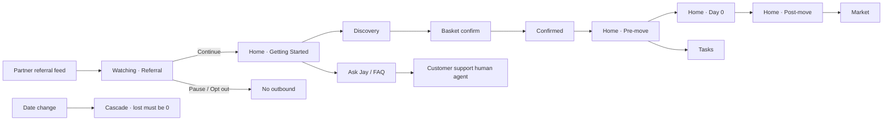

# Product proposal
**Jeanne Piffaut · Jay · July 2026**

Part of the Jay case study. Full index in CASE-STUDY.md.

Demo: https://just-move-in-liard.vercel.app  
Linked research: [02 · Research](02-RESEARCH.md) · Feature spine: [07 · Feature bridge](07-FEATURE-BRIDGE.md)  
Deep PRD: [`03-product-strategy-prd.md`](../../03-product-strategy-prd.md)

---

## 1. Product vision

### 1.1 What is going on

Just Move In historically solved home setup brilliantly through people: a home setup call. The strategic question is the digital, and specifically AI, equivalent of that call.

We are moving from a **call flow** to an **app digital flow**. Same customers being funnelled through partners. The competitive advantage of the funnel stays. What changes is the experience (call → app) and the business model (annual utility economics + recurring cashflow layers).

### 1.2 Proposal

Provide users with more service layers to turn yearly cashflow into recurring cashflow.

**How:** foster trust, be useful (value beyond monetisation), transparency, seamless design, and honest status to reduce anxiety of the steps.

Movers do not know what they do not know. Pre, during, post. The product is the anchor in a process that already carries too much anxiety.

### 1.3 Users (from the brief + research)

| User | Job |
|---|---|
| **Mover (referred sceptic)** | Get set up without being scammed, without retyping facts, with a human if needed |
| **Partner (letting / estate agent)** | Refer once; look good; optionally see value from the relationship |
| **Customer support human agent** | Escape hatch for money, complaints, vulnerability, twice-failed automation |
| **Jay** | Operator software: understand / decide surface / do the admin |

### 1.4 North star and OKR sketch

| | Draft (to validate with JMI) |
|---|---|
| **North star** | Seamless move completion **and** partner value: the best tool for the mover *and* a durable B2B2C engine. Longevity through making a great product for both B and C. |
| **Objective O1** | Earn permission and complete watching → active without unsolicited outbound |
| **KR examples** | Opt-out rate; pause vs continue; activation to basket confirm |
| **Objective O2** | Honest execution: no false confirmed; chase tasks stuck in sent · no receipt |
| **KR examples** | % tasks with receipt; false-confidence incidents = 0 |
| **Objective O3** | Stickiness in the 3-month habit window |
| **KR examples** | Market return visits; post-move task completion; survey response rate |

Predictions and what to look for: see analytics mock [`analytics/dashboard.html`](../../analytics/dashboard.html) and [`FLOWS-EVENTS-ANALYTICS.md`](../../FLOWS-EVENTS-ANALYTICS.md).

---

## 2. Commercial strategy (summary)

| Stream | Role | Notes |
|---|---|---|
| **Utilities panel (annual)** | Core revenue | Energy, broadband, contents. One recommendation, panel fee disclosed once. |
| **Marketplace cashflow** | Recurring / episodic | Bookings, partners. Commission designed so suppliers do not flee to cash. |
| **Sponsored visibility** | Extra cash for extra visibility | Checkatrade-inspired: partners can pay for lift. Intent-led, not in-face. |
| **Vouchers / housewarming** | Stickiness + affiliate | One place to view them all (Revolut-like). After experience, not before trust. |
| **Not doing in v1** | Bills bundling | Stay out of the invoice. |

Ads / sponsored placement: **after experience, in Market**, with clear partner labelling. Detail and open questions in [08 · Later / discuss](08-LATER-DISCUSS.md).

---

## 3. Placeholder roadmap (Gantt)

Owners are proposals for co-ownership, not assignments.

| Phase | Window | Owners (proposed) | Outcome |
|---|---|---|---|
| **P0 Spine** | Weeks 1-6 | Eng + Product | Watching gate, LOA, discovery → basket → confirm, receipt constraint, cascade worker |
| **P1 Day 0 + honesty** | Weeks 5-10 | Eng + Design + CS | Voice/UI keys+meters, chase of sent · no receipt, customer support human agent escalation rules |
| **P2 Tasks truth** | Weeks 8-12 | Eng + Design | Single task store, List/Board/Visual, push on deadlines |
| **P3 Market v1** | Weeks 10-16 | Product + Commercial + Eng | Labelled listings, panel fee, booking hooks |
| **P4 Partner value** | Weeks 14-20 | Product + Sales + Research | Weekly partner report discovery + first template |
| **P5 Stickiness bets** | After P0-P2 proven | Product + Design | Packing space, vote-on-features, vouchers hub (see Later) |

```
P0 Spine     ████████
P1 Day0      ····████████
P2 Tasks     ········████████
P3 Market    ··········████████
P4 Partners  ··············████████
P5 Sticky    ······················ (gated)
```

---

## 4. Per tab · proposal snapshot

For each surface: vision, branding/commercial, feature ideas (shipped vs later), testing, risks, next.

### Referral / watching
- **Proposal:** Earn permission from someone who did not choose Jay. Name the referring agent (trust). Watching until exchange.
- **Commercial:** No monetisation on this screen. Trust is the conversion.
- **Shipped:** Value cards, Priya Shah / Kentish Town Lettings, pause, opt-out, named customer support human agent.
- **Next:** Partner-specific variants; measure opt-out vs pause vs continue.
- **Risk:** Still feels like spam if partner data is wrong.

### Home (Getting Started → Pre → Day 0 → Post)
- **Proposal:** The move hub. Anchor. Where am I / what is happening / what next.
- **Shipped:** Stages, LOA, discovery/basket CTAs, pre-move You then Jay, Day 0 voice+UI, post survey.
- **Later:** Stronger stepper if anxiety needs it; packing creativity (Later).
- **Risk:** Density. Resist burying must-do behind expanders (user rejected that).

### Discovery
- **Proposal:** Collect once, reuse. Structured choices primary; Ask Jay side channel.
- **Design intent:** Nudging toward complete answers; not a chatbot front door.
- **Voice answer (brief):** Provide **both**. Everyone has phone data; people prefer quick UI for predictable work; if they need the security of someone, a customer support human agent is there and CS is notified. Day 0 is the exception where voice leads for access.
- **Later:** One-question-at-a-time A/B (user prefers one flow today).

### Basket
- **Proposal:** Jay’s recommended Energy / Broadband / Contents. Why visible. Alts not equal. Safety + panel fee.
- **Commercial:** Core annual revenue moment.
- **Evidence:** Ofgem one-pick; Trustpilot opacity; survey 1-tap.

### Confirmed
- **Proposal:** Calm closure. Jay is handling vs Needs you next. Honest states.
- **Risk:** Becoming another dense dashboard. Keep the split.

### Tasks
- **Proposal:** System of record. List default on phone; Board + Visual available.
- **Later:** “My packing” / personal Notion-like lists; user-added todos as discovery mechanism (Wise-like voting).

### Market
- **Proposal:** Permanent section. Intention-led. Free NHS/council vs local vs panel in the trust line. Panel fee once.
- **Commercial:** Cashflow + sponsored visibility (Later placement rules).
- **Later:** Commission design with suppliers; branding packs for businesses.

### Settings
- **Proposal:** Control: LOA, pause, opt-out, notifications, date change, left-hand mode, audit.
- **Left-hand mode:** Flip ask bar and primary nav taps for left-handed movers and Day 0 one-hand use. Inclusion, not branding.
- **Later:** Font size / accessibility controls.

### Ask Jay + customer support human agent
- **Proposal:** Supporting functionality. Questions, explanations, changes, exceptions, reaching a person. Not the primary interface for predictable tasks.
- **Note:** The named customer support escape may feel duplicated; tune frequency with Design (Later).

---

## 5. Design decisions that are load-bearing (product view)

- Put information forward: foster trust and transparency.
- User can override status that is **not** a Jay-owned locked task (discuss exact rules with Eng).
- Journey indicator / stages so the mover understands current stage and what comes next. The app needs to feel like the **anchor**.
- Each screen in a few seconds: **Where am I? What is happening? What should I do next?** Clear headings, short context, one dominant next action, quieter secondary actions, consistent status labels, whitespace. (Expanders rejected in this prototype.)

---

## 6. Full UX flow (in and outside the UI)



Outside UI: solicitor/agent date feed, council/water/supplier adapters, chase scheduler, CS escalation, partner weekly report (future).

Engineering event charts: [`FLOWS-EVENTS-ANALYTICS.md`](../../FLOWS-EVENTS-ANALYTICS.md).

---

## 7. Post launch · evaluation

| Layer | What |
|---|---|
| **Success metrics** | Activation funnel, basket confirm rate, time-to-chase for sent · no receipt, Day 0 keys completion, Market return, opt-out rate |
| **Guardrails / kill** | Outbound while watching; false confirmed; cascade lost > 0; distress without customer support human agent path |
| **Internal dashboard** | [`analytics/dashboard.html`](../../analytics/dashboard.html) as the mock; production specs in FLOWS wiki |
| **Partner report** | Per-referred-client value; established **with** partners (discovery first). Weekly. Qualitative + quantitative. |
| **Analysis plan** | Qualitative (CS + directed storytelling) + app events + market trends → opportunities agents do not know about |

---

## 8. Product FAQ (short)

**Is this a chatbot?** No. Structured workflows primary; Ask Jay is a side channel.

**When do you contact suppliers?** After exchange (or equivalent) and consent. Watching means no outbound.

**How do you get paid?** Panel fee, same across the panel, disclosed once. Market partners labelled.

**Why one recommendation?** Choice architecture backed by Ofgem trial conversion patterns; alts still browsable.

**Where is the human?** A customer support human agent, named, callable, especially on money, complaints, vulnerability.

**Is the demo production?** No. No real council or supplier actions. Prototype for co-building.

---

## 9. Links to stakeholder notions

| Notion | File |
|---|---|
| Engineering | [04 · Engineering](04-ENGINEERING.md) |
| Design | [05 · Design](05-DESIGN.md) |
| Sales & CS | [06 · Sales & Customer Support](06-SALES-CUSTOMER-SUPPORT.md) |
| Research / case approach | [01 · Approach](01-APPROACH.md) + [02 · Research](02-RESEARCH.md) |
| Later / discuss | [08 · Later / discuss](08-LATER-DISCUSS.md) |

---

## 10. References (quotes & sources)

Use end references from Deliverables 1-2 and survey §4. Do not present n=12 as proven demand. Label small-sample and directional research clearly.
